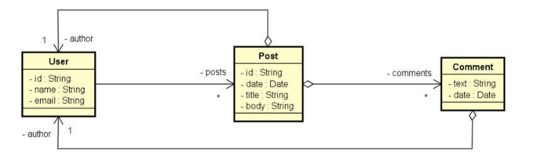

Projeto de posts com objetivo de compreender as principais diferenças entre banco de dados
noSQL usando mongoDB.

Neste projeto você encontra:
- Operações CRUD.
- Banco de dados orientado a documentos.
- Associações entre objetos do tipo: Objetos aninhados e referências.
- Consultas com Spring Data e MongoRepository.

### Diagrama


```
{
    "id": "1001",
    "name": "Maria Brown",
    "email": "maria@gmail.com",
    "posts": ["5001", "5010"]
}
{
    "id": "5001",
    "date": "2018-03-21",
    "title": "Partiu viagem",
    "body": "Vou viajar para São Paulo. Abraços!",
    "author": {
        "id": "1001",
        "name": "Maria Brown"
    },
    "comments": [
        {
            "text": "Boa viagem mano!",
            "date": "2018-03-21",
            "author": {
                "id": "1013",
                "name": "Alex Green"
            }
        },
        {
            "text": "Aproveite!",
            "date": "2018-03-22",
            "author": {
                "id": "1027",
                "name": "Bob Grey"
            }
        }
    ]
}
{
    "id": "5010",
    "date": "2018-03-23",
    "title": "Bom dia",
    "body": "Acordei feliz hoje!",
    "author": {
        "id": "1001",
        "name": "Maria Brown"
    },
    "comments": [
        {
            "text": "Tenha um ótimo dia!",
            "date": "2018-03-23",
            "author": {
                "id": "1013",
                "name": "Alex Green"
            }
        }
    ]
}
```